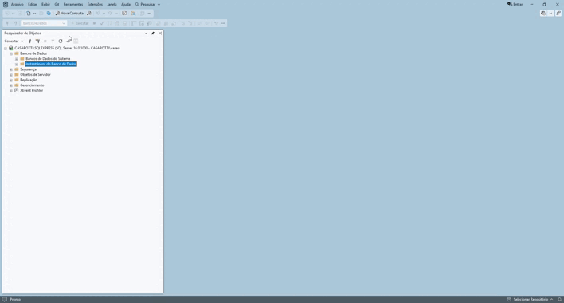
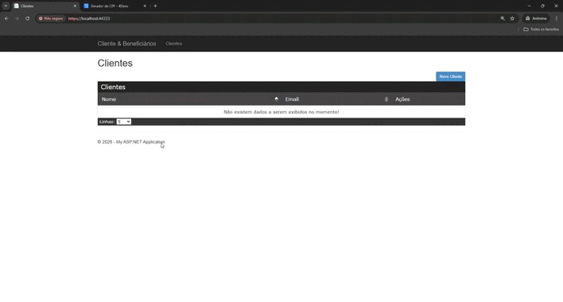

📋 Sistema de Cadastro de Clientes e Beneficiários

📖 Sobre o Projeto
Sistema web para gerenciamento completo de clientes e seus respectivos beneficiários, com foco em integridade de dados e validações de negócio.

Principais Funcionalidades
 
• ✅ Gestão de Clientes: Fluxo completo de inclusão, alteração, exclusão e listagem.
 
• ✅ Gestão de Beneficiários: Vínculo de múltiplos beneficiários por cliente via modal.
 
• ✅ Validação de CPF: Algoritmo de validação implementado no Frontend e Backend.
 
• ✅ Unicidade de Registro: Bloqueio de CPFs duplicados para um mesmo cliente.

🛠️ Tecnologias e Arquitetura
• Backend: ASP.NET MVC 5 (.NET Framework 4.8), ADO.NET, SQL Server.
• Frontend: jQuery, JavaScript, Bootstrap.
• Arquitetura: Camadas (MVC, BLL, DAL, DML).

🗄️ Configuração do Banco de Dados
O projeto já fornece o banco pré-configurado no arquivo .mdf. Siga os passos abaixo na ordem indicada:

Passo 1: Permissões de Pasta (Crítico)
Atenção: Para evitar o erro de "Acesso Negado" no SSMS, certifique-se de que o serviço do SQL Server tenha permissões na pasta do arquivo.
1. Clique com o botão direito na pasta do projeto e vá em Propriedades > Segurança.
2. Clique em Editar > Adicionar > Digite Todos (ou Everyone) e clique em OK.
3. Marque a opção Controle Total e aplique.

Passo 2: Anexar o Banco (Attach)
1. Abra o SQL Server Management Studio (SSMS).
2. Clique com o botão direito em Databases > Attach....
3. Clique em Add e navegue até: C:\Atividade-Entrevista\FI.WebAtividadeEntrevista\FI.WebAtividadeEntrevista\App_Data\BancoDeDados.mdf
4. Clique em OK. O banco "BancoDeDados" aparecerá na sua lista.

Passo 3: Execução dos Scripts Obrigatórios
Mesmo após o Attach, é obrigatório rodar os scripts para atualizar as tabelas e as Stored Procedures (todas utilizam CREATE OR ALTER).
• Opção 01 (Recomendada): Execute o Script Consolidado para atualizar tudo de uma vez: "...\FI.WebAtividadeEntrevista\FI.WebAtividadeEntrevista\App_Data\Novos scripts\scripts.sql"

• Opção 02 (Manual): Execute os scripts individualmente na ordem abaixo:
1. "...\FI.WebAtividadeEntrevista\FI.WebAtividadeEntrevista\App_Data\Novos scripts\01 - Adicionando o CPF\script01.sql"
2. "...\FI.WebAtividadeEntrevista\FI.WebAtividadeEntrevista\App_Data\Novos scripts\02" - Procedures Cliente
3. C...\FI.WebAtividadeEntrevista\FI.WebAtividadeEntrevista\App_Data\Novos scripts\03 - Procedures Beneficiario

🔗 Configuração da Connection String
No arquivo Web.config, ajuste o campo connectionString para apontar para o seu servidor local:

<connectionStrings>
    <add name="BancoDeDados" connectionString="Data Source=NOME_DO_SEU_SERVIDOR;Initial Catalog=BancoDeDados;Integrated Security=True;TrustServerCertificate=True" />
</connectionStrings>

🧪 Observações para Testes e Desenvolvimento

Para testar as funcionalidades de inclusão e alteração, o sistema utiliza um algoritmo de validação de CPF (Dígitos Verificadores).

• Dica: Para gerar CPFs válidos para teste, utilize ferramentas como o Gerador de CPF da 4Devs (https://www.4devs.com.br/gerador_de_cpf).

Fluxo de Trabalho (Git)
[!IMPORTANT]
Nota sobre Versionamento: Devido ao prazo estipulado para a entrega técnica, os commits foram realizados diretamente na branch principal, sem a abertura de Merge Requests (MRs) ou Pull Requests (PRs).

Tenho total domínio e ciência das boas práticas de versionamento, incluindo a criação de feature branches, revisões de código via MR/PR e resolução de conflitos, as quais utilizo diariamente em meu ambiente profissional.

## 📺 Demonstração em Vídeo

### ⚙️ Execução dos Scripts

### 👥 Cadastro de Clientes e Beneficiários

